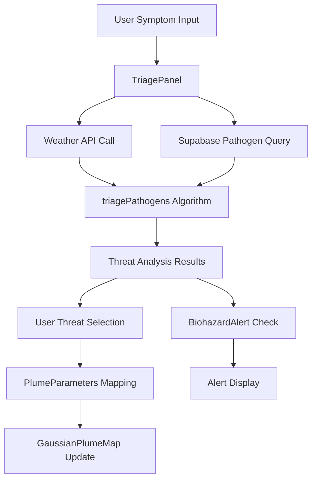

# Triage Dashboard Design Document

## Overview

The Triage Dashboard is a critical React component that integrates symptom analysis, pathogen identification, and dispersion visualization within the V.I.C.T.O.R. system. It serves as the primary interface for emergency response teams to assess biological threats and visualize their potential spread patterns.

The dashboard combines three key subsystems:
1. **TriagePanel** - User interface for symptom input and threat analysis
2. **Pathogen Analysis Engine** - Integration with existing triage algorithms and Supabase pathogen database
3. **Dispersion Visualization** - Integration with the existing Gaussian plume mapping system

## Architecture

### Component Hierarchy
```
TriageDashboard (Main Container)
├── TriagePanel
│   ├── SymptomSelector
│   ├── ThreatAnalysisDisplay
│   └── BiohazardAlert
└── GaussianPlumeMap (Existing Component)
    ├── PlumeParameterControls
    ├── PlumePolygonOverlay
    └── SourceMarker
```

### Data Flow Architecture


### Integration Points
- **Existing Triage Algorithm**: Leverages `lib/triage/algorithm.ts` and related modules
- **Existing Map Component**: Integrates with `components/gaussian-plume-map.tsx`
- **Supabase Integration**: Uses existing `lib/supabase/pathogen-data.ts` and queries
- **Weather Service**: Integrates with existing weather data fetching capabilities

## Components and Interfaces

### TriageDashboard (Main Component)
```typescript
interface TriageDashboardProps {
  initialMapCenter?: [number, number];
  initialMapZoom?: number;
}

interface TriageDashboardState {
  selectedSymptoms: Symptom[];
  triageResults: TriageResult | null;
  selectedThreat: PathogenScore | null;
  isAnalyzing: boolean;
  weatherData: WeatherConditions | null;
  showBiohazardAlert: boolean;
}
```

### TriagePanel Component
```typescript
interface TriagePanelProps {
  onSymptomsSubmit: (symptoms: Symptom[]) => void;
  triageResults: TriageResult | null;
  onThreatSelect: (threat: PathogenScore) => void;
  selectedThreat: PathogenScore | null;
  isAnalyzing: boolean;
}
```

### SymptomSelector Component
```typescript
interface SymptomSelectorProps {
  availableSymptoms: string[];
  selectedSymptoms: Symptom[];
  onSymptomToggle: (symptom: Symptom) => void;
  onSubmit: () => void;
  disabled?: boolean;
}
```

### ThreatAnalysisDisplay Component
```typescript
interface ThreatAnalysisDisplayProps {
  triageResults: TriageResult | null;
  onThreatSelect: (threat: PathogenScore) => void;
  selectedThreat: PathogenScore | null;
}
```

### BiohazardAlert Component
```typescript
interface BiohazardAlertProps {
  isVisible: boolean;
  selectedThreat: PathogenScore | null;
  onDismiss: () => void;
}
```

## Data Models

### Extended Pathogen Data
The dashboard will use the existing Supabase pathogen schema with additional computed fields:

```typescript
interface EnhancedPathogenScore extends PathogenScore {
  r0Score: number;
  transmissionVector: TransmissionVector;
  incubationPeriod: number;
  minHumiditySurvival: number;
}
```

### PlumeParameters Mapping
```typescript
interface PathogenToPlumeMapping {
  pathogenId: string;
  emissionRate: number;    // Derived from R0 score
  stackHeight: number;     // Derived from transmission vector
  windDirection: number;   // From weather data
  windSpeed: number;       // From weather data
}
```

### Symptom Configuration
```typescript
interface SymptomConfig {
  id: string;
  displayName: string;
  category: 'respiratory' | 'gastrointestinal' | 'neurological' | 'hemorrhagic' | 'systemic';
  severity: 'mild' | 'moderate' | 'severe';
}
```

## Correctness Properties

*A property is a characteristic or behavior that should hold true across all valid executions of a system-essentially, a formal statement about what the system should do. Properties serve as the bridge between human-readable specifications and machine-verifiable correctness guarantees.*
Property 1: Symptom validation and preparation
*For any* valid symptom selection from the available list, the validation and data preparation process should succeed and produce properly formatted data for threat analysis
**Validates: Requirements 1.2**

Property 2: Weather data fetching on symptom submission
*For any* map center coordinates, submitting symptoms should trigger a weather API call using those exact coordinates
**Validates: Requirements 2.1**

Property 3: Pathogen database query after weather retrieval
*For any* successful weather data retrieval, the system should automatically query the Supabase pathogen database for relevant pathogen information
**Validates: Requirements 2.2**

Property 4: Graceful error handling
*For any* network failure scenario during data retrieval, the system should handle the error gracefully and display appropriate error messaging without crashing
**Validates: Requirements 2.3**

Property 5: Algorithm execution with complete data
*For any* combination of valid symptom and environmental data, the triagePathogens algorithm should execute and produce threat analysis results
**Validates: Requirements 3.1**

Property 6: Threat ranking and display
*For any* threat analysis results, the displayed list should be ordered by likelihood and severity in descending order
**Validates: Requirements 3.2**

Property 7: Result presentation completeness
*For any* completed threat analysis, the presented results should include threat indicators and confidence levels for each detected threat
**Validates: Requirements 3.3**

Property 8: Threat selection triggers map update
*For any* threat selected from the detected threats list, the map's PlumeParameters should be automatically updated to reflect that threat's characteristics
**Validates: Requirements 4.1**

Property 9: R0 score to emission rate mapping
*For any* pathogen R0 score, the mapping to emission rate should be consistent and mathematically sound across all possible R0 values
**Validates: Requirements 4.2**

Property 10: Transmission vector to stack height mapping
*For any* pathogen transmission vector, airborne pathogens should map to high stack heights and fluid transmission pathogens should map to ground level stack heights
**Validates: Requirements 4.3**

Property 11: Wind data incorporation
*For any* current wind conditions, the plume direction calculation should accurately incorporate wind speed and direction data
**Validates: Requirements 4.4**

Property 12: Biohazard alert triggering
*For any* pathogen with R0 score above the defined threshold, selecting that pathogen should trigger the display of a prominent Bio-Hazard alert overlay
**Validates: Requirements 5.1**

Property 13: Alert persistence management
*For any* active biohazard alert, the alert should remain visible until explicitly cleared by threat deselection or selection of a different pathogen
**Validates: Requirements 5.3**

## Error Handling

### Network Error Handling
- **Weather API Failures**: Display user-friendly error messages and provide retry mechanisms
- **Supabase Connection Issues**: Implement connection pooling and graceful degradation
- **Timeout Handling**: Set appropriate timeouts for all external API calls

### Data Validation
- **Symptom Input Validation**: Ensure all selected symptoms are from the predefined list
- **Weather Data Validation**: Validate temperature and humidity ranges before processing
- **Pathogen Data Integrity**: Verify database query results before algorithm execution

### User Experience Error States
- **Loading States**: Clear visual indicators during data fetching and processing
- **Empty States**: Appropriate messaging when no threats are detected
- **Calculation Errors**: User-friendly error messages for algorithm failures

## Testing Strategy

### Unit Testing Approach
The dashboard will use **Vitest** as the testing framework, following the existing project patterns. Unit tests will focus on:

- Component rendering and user interactions
- Data transformation and validation functions
- Error handling edge cases
- Integration points between components

### Property-Based Testing Approach
Property-based tests will use **fast-check** library to verify universal properties across all inputs. Each property-based test will:

- Run a minimum of 100 iterations to ensure comprehensive coverage
- Use smart generators that constrain inputs to valid ranges
- Test core business logic across many input combinations
- Validate integration between subsystems

**Property-Based Testing Configuration:**
```typescript
// Each property test will be configured with:
fc.configureGlobal({
  numRuns: 100,
  verbose: true,
  seed: 42 // For reproducible test runs
});
```

**Test Tagging Convention:**
Each property-based test will include a comment explicitly referencing the design document property:
```typescript
// **Feature: triage-dashboard, Property 1: Symptom validation and preparation**
```

### Integration Testing
- **API Integration**: Mock external services (weather API, Supabase) for consistent testing
- **Component Integration**: Test data flow between TriagePanel and GaussianPlumeMap
- **End-to-End Workflows**: Verify complete user journeys from symptom input to visualization

### Performance Testing
- **Algorithm Performance**: Monitor triage algorithm execution time with large pathogen datasets
- **Map Rendering**: Ensure plume visualization updates don't cause UI lag
- **Memory Usage**: Verify no memory leaks during repeated threat analysis cycles

## Implementation Notes

### Styling and Theming
Following V.I.C.T.O.R. design philosophy:
- Pure black backgrounds (`bg-black`)
- High-contrast borders using red (`border-red-500/600`) and yellow (`border-yellow-500/600`)
- Monospaced fonts (Geist Mono) for data displays
- Minimal color palette focused on readability and urgency indicators

### Performance Considerations
- **Debounced Symptom Selection**: Prevent excessive API calls during rapid symptom selection
- **Memoized Calculations**: Cache plume parameter calculations for identical inputs
- **Lazy Loading**: Load pathogen data only when needed
- **Optimistic Updates**: Update UI immediately while background processing continues

### Accessibility Requirements
- **Keyboard Navigation**: Full keyboard support for all interactive elements
- **Screen Reader Support**: Proper ARIA labels and semantic HTML structure
- **High Contrast**: Ensure all text meets WCAG AA contrast requirements
- **Focus Management**: Clear focus indicators for emergency use scenarios

### Security Considerations
- **Input Sanitization**: Validate all user inputs before processing
- **API Rate Limiting**: Implement client-side rate limiting for external API calls
- **Data Privacy**: Ensure no sensitive patient data is logged or cached
- **Error Information**: Avoid exposing internal system details in error messages